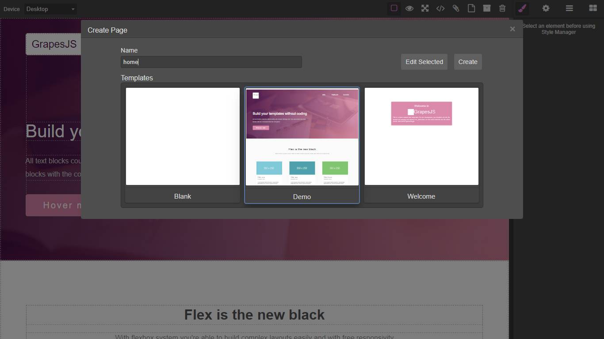

# Grapesjs Indexeddb UI

UI helpers for IndexedDB Storage

>Requires GrapesJS v0.14.15 or higher

>Some templates can be found in `templates.json`

### Templates
<p align="center">
  
</p>

### Pages
<p align="center">
  
</p>

### HTML
```html
<link href="https://unpkg.com/grapesjs/dist/css/grapes.min.css" rel="stylesheet">
<script src="https://unpkg.com/grapesjs"></script>
<link href="https://unpkg.com/grapesjs-indexeddb-ui/dist/grapesjs-indexeddb-ui.min.css" rel="stylesheet">
<script src="https://unpkg.com/grapesjs-indexeddb-ui"></script>

<div id="gjs"></div>
```

### JS
```js
const editor = grapesjs.init({
	container: '#gjs',
  height: '100%',
  fromElement: true,
  storageManager: {
    id: 'gjs-',
    type: 'indexeddb',
  },
  plugins: ['grapesjs-indexeddb-ui'],
});
//Add Panel Buttons
const pn = editor.Panels;
const panelOpts = pn.addPanel({
  id: 'options'
});
panelOpts.get('buttons').add([{
  attributes: {
    title: 'Open Templates'
  },
  className: 'fa fa-paperclip',
  command: 'open-templates',//Open modal with templates which can be used when creating new page
  id: 'open-templates'
}, {
  attributes: {
    title: 'Open Pages'
  },
  className: 'fa fa-file-o',
  command: 'open-pages',//Open modal listing your pages 
  id: 'open-pages'
}, {
  attributes: {
    title: 'Save As Template'
  },
  className: 'fa fa-archive',
  command: 'save-as-template',//Save page as template
  id: 'save-as-template'
}, {
  attributes: {
    title: 'Delete from IDB'
  },
  className: 'fa fa-trash-o',
  command: 'delete-from-idb',//Delete open page or template
  id: 'delete-from-idb'
}, {
  attributes: {
    title: 'Take Screenshot'
  },
  className: 'fa fa-camera',
  command: 'take-screenshot',//Take an image of the canvas
  id: 'take-screenshot'
}]);
```

### CSS
```css
body, html {
  margin: 0;
  height: 100%;
}
```


## Summary

* Plugin name: `grapesjs-indexeddb-ui`
* Storage
    * `indexeddb`
* Commands
    * `open-templates`
    * `open-pages`
    * `save-as-template`
    * `delete-from-idb`
    * `take-screenshot`
    * `get-current-id`
    * `get-current-idx`
    * `get-uuidv4`

```js
editor.runCommand('get-current-idx') // Will return uuid of current page
editor.runCommand('get-current-id') // Will return name/id of current page
editor.runCommand('get-uuidv4') // Will return a uuid
```

> This plugin uses the [`<foreignObject>`](https://developer.mozilla.org/en-US/docs/Web/SVG/Element/foreignObject) [SVG](https://developer.mozilla.org/en-US/docs/Web/SVG) element to simulate thumbnails which works well for projects which do not use any external stylesheets such as bootstrap. If your pages rely on external stylesheets you can store image thumbnails with your pages via the `take-screenshot` command which uses the [dom-to-image](https://github.com/tsayen/dom-to-image) library to generate thumbnails. You can also access this library through `editor.domtoimage`. External images may fail to render due to CORS restrictions.


## Options

| Option | Description | Default |
|-|-|-
| `dbName` | DB name | `gjs` |
| `objectStoreName` | Collection name | `templates` |
| `indexeddbVersion` | DB version | `4` |
| `addOnUpgrade` | Add items on DB schema upgrade | `0` |
| `defaultPage` | Name/ID of the page that is loaded by default on editor restart | `Default` |
| `defaultTemplate` | Name/ID of the template that is selected by default | `Blank` |
| `blankTemplate` | Blank page added to templates, pass falsy expression to prevent loading | `{id: 'Blank',template: true,'gjs-html': '','gjs-css': ''}` |
| `onDelete` | When template or page is deleted | `console.log('Deleted:', res)` |
| `onDeleteError` | When error onDelete | `console.log(err)` |
| `onScreenshotError` | Error taking screenshot | `console.log(err)` |
| `quality` | Quality of screenshot image from 0 to 1, more quality increases the image size | `0.01` |
| `templatesMdlTitle` | Content for templates modal title | `<div style="font-size: 1rem">Create Page</div>` |
| `pagesMdlTitle` | Content for pages modal title | `<div style="font-size: 1rem">Select Page</div>` |
| `onload` | Custom onload function used only when storage isn't indexeddb | ` ` |
| `onedit` | Custom on edit function used to edit the page name if storage isn't indexeddb | ` ` |


## Download

* CDN
  * `https://unpkg.com/grapesjs-indexeddb-ui`
* NPM
  * `npm i grapesjs-indexeddb-ui`
* GIT
  * `git clone https://github.com/Ju99ernaut/grapesjs-indexeddb-ui.git`


## Usage

Directly in the browser
```html
<link href="https://unpkg.com/grapesjs/dist/css/grapes.min.css" rel="stylesheet"/>
<script src="https://unpkg.com/grapesjs"></script>
<link href="path/to/grapesjs-indexeddb-ui/dist/grapesjs-indexeddb-ui.min.css" rel="stylesheet"/>
<script src="path/to/grapesjs-indexeddb-ui.min.js"></script>

<div id="gjs"></div>

<script type="text/javascript">
  var editor = grapesjs.init({
      container: '#gjs',
      storageManager: {
        id: 'gjs-',
        type: 'indexeddb',
      },
      // ...
      plugins: ['grapesjs-indexeddb-ui'],
      pluginsOpts: {
        'grapesjs-indexeddb-ui': { 
          // Database name
          dbName: 'gjs',

          // Collection name
          objectStoreName: 'templates',

          // Indexeddb version schema
          indexeddbVersion: 4,

          // Load on schema upgrade
          addOnUpgrade: [{
              "id": "Template 1",
              "template": true,
              "gjs-html": "<div id=\"id\">This is demo content...</div>",
              "gjs-css": "#id{margin:100px 100px 25px; padding:25px; font:caption}",
              "gjs-components": "",
              "gjs-style": ""
            },// Note prefix should be the same as storageManager id in this case 'gjs-'
            //...
          ]
         }
      }
  });
  //Add Panel Buttons
</script>
```

Modern javascript
```js
import grapesjs from 'grapesjs';
import plugin from 'grapesjs-indexeddb-ui';
import 'grapesjs/dist/css/grapes.min.css';
import 'grapesjs-indexeddb-ui/dist/grapesjs-indexeddb-ui.min.css';

const editor = grapesjs.init({
  container : '#gjs',
  storageManager: {
    id: 'gjs-',
    type: 'indexeddb',
  },
  // ...
  plugins: [plugin],
  pluginsOpts: {
    [plugin]: { /* options */ }
  }
  // or
  plugins: [
    editor => plugin(editor, { /* options */ }),
  ],
});
//Add Panel Buttons
```

## Other Storage types

For usage with other storage types they will need to have the same structure as the [indexeddb](https://github.com/Ju99ernaut/grapesjs-indexeddb-ui/blob/master/src/index.js) storage. Also add the following options on `init`:

```js
onload() {
  //add blank template if none
  //set idx and templateIdx
},

onedit(idx, name) {
  //update name of record with idx
}
```


## Development

Clone the repository

```sh
$ git clone https://github.com/Ju99ernaut/grapesjs-indexeddb-ui.git
$ cd grapesjs-indexeddb-ui
```

Install dependencies

```sh
$ npm i
```

Start the dev server

```sh
$ npm start
```

Build the source

```sh
$ npm run build
```


## License

MIT
